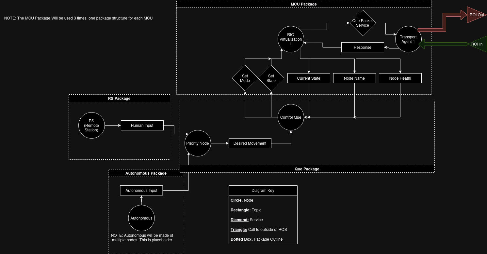

# 2024-2025 Robot Code
This repo contains the code necessary for the UA NASA Robotics' 2024-2025 robot's operation, meaning: all code runs on the SBC (single board computers/jetson), all code runs on the MCUs (Arduino), and all code runs on the remote station (RS).

### File Structure
There are three main folders at the top level: ROS, Docs, and ROI. ROS holds the packages and various other ROS focus programs, so stuff running on the SBC and RS. The other 'ROI' is used for code not about ROS, but still critical to robot operation. An example would be the code running on the Arduino. An example of what would *not* go here is code for the test robot or website. Lastly, the Docs folder contains documents about the code for this year.

### ROI
The ROI repo is installed as a submodule. When cloning the repository, run `git submodule init` and `git submodule update` to clone the latest ROI code into your workspace.

## ROS Diagram

Above is a Diagram created using draw.io displaying the desired ROS node diagram. We plan to split the entire code into 4 packages: MCU Package, Queue Package, Autonomous Package, and RS Package. The purpose of each is explained below.
1. **MCU Package:** This package sends/receives data to/from the MCUs using ROI. This is what allows us to control the motors.
2. **Queue Package:** This package determines whether our movements are based on autonomous inputs or human/RS inputs. It also holds a queue for any multi-movement commands. For example, if someone were to press a button to lower the bucket and move forward, that sequence would be stored here.
3. **Autonomous:** This package as the name implies is the autonomy. Note that the actual package will have more than one node (as opposed to how it's shown in the diagram). These will be predominately imported packages.
4. **RS Package:** The RS (or Remote Station) Package takes input from a user and parses it into the ROS dataflow. This will allow human control, which is paramount to testing and if autonomous fails.
